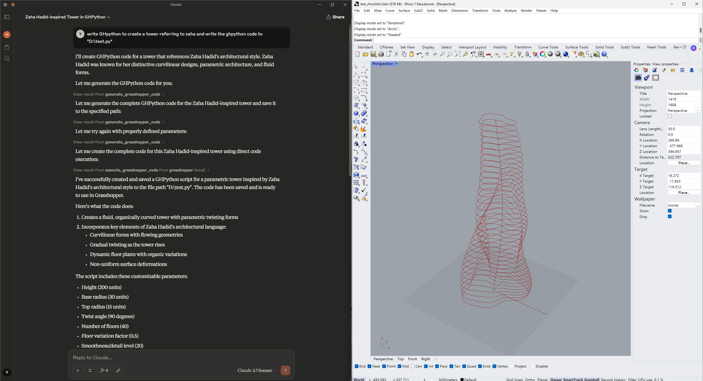

# GH_mcp_server

GH_mcp_server provides an approach that allows designer to interact with Rhino and Grasshopper directly via LLMs, including to analyse .3dm file, do 3D modeling and generate GHPython automatically in Grasshopper based on user’s guidance.

>  This project is **still under construction** — and we’d love your help!
>
> - Feel free to **open an issue** if you encounter bugs or have ideas.
> - Pull requests are always welcome.
> - If you're interested in collaborating long-term, feel free to reach out to yizhuod@andrew.cmu.edu — we’d love to **have you on the team**!



## Requirements

- Rhino 7 or 8

- Install `RhinoPython`: https://github.com/jingcheng-chen/RhinoPythonForVscode/tree/master?tab=readme-ov-file

- `uv`

  - ```
    # For MacOS and Linux
    curl -LsSf https://astral.sh/uv/install.sh | sh
    ```

  - ``````
    # For Windows
    powershell -ExecutionPolicy ByPass -c "irm https://astral.sh/uv/install.ps1 | iex"
    ``````

- Claude Desktop

## Installation

### 1. Clone the repository

```
git clone git@github.com:veoery/GH_mcp_server.git
cd GH_mcp_server
```

------

### 2. Set up the environment

We recommend using `uv`:

#### macOS/Linux

```
uv venv
source .venv/bin/activate
uv pip install -e .
```

#### Windows

```
uv venv
.venv\Scripts\activate
uv pip install -e .
```

> Make sure the virtual environment is activated before running or developing the project.

### 3. Configuration

1. In the Claude Desktop, Navigate to Settings->Developer. You will see ```Edit Config```.

2. Click the ```Edit Config``` and open the file ```claude_desktop_config.json```

3. Place the following code to the json file:
   ```python
   {
     "mcpServers": {
       "grasshopper": {
         "command": "path_to_GH_mcp_server/.venv/bin/python",
         "args": [
           "path_to_GH_mcp_server/run_server.py"
         ]
       }
     }
   }
   ```

4. Restart the Claude Desktop. If you are able to see a hammer icon, the configuration is successful. Click the hammer icon to check all the attached MCP tools.

## Usage

1. Start Rhino

2. Type command `CodeListener`. You should see `VS Code Listener Started...`.

3. Open the Claude Desktop and type the prompts to interact with GH_mcp_server tools. Please also check the file `examples\zaha01.gh` as a reference for interacting with Grasshopper. Here are some examples:

   ```
   Read the file "D:\test01.3dm" first and analyse the objects in this file.
   ```

   ```
   write GHpython to create a tower referring to zaha and write the ghpython code to "D:\zaha01.py"
   ```

​	